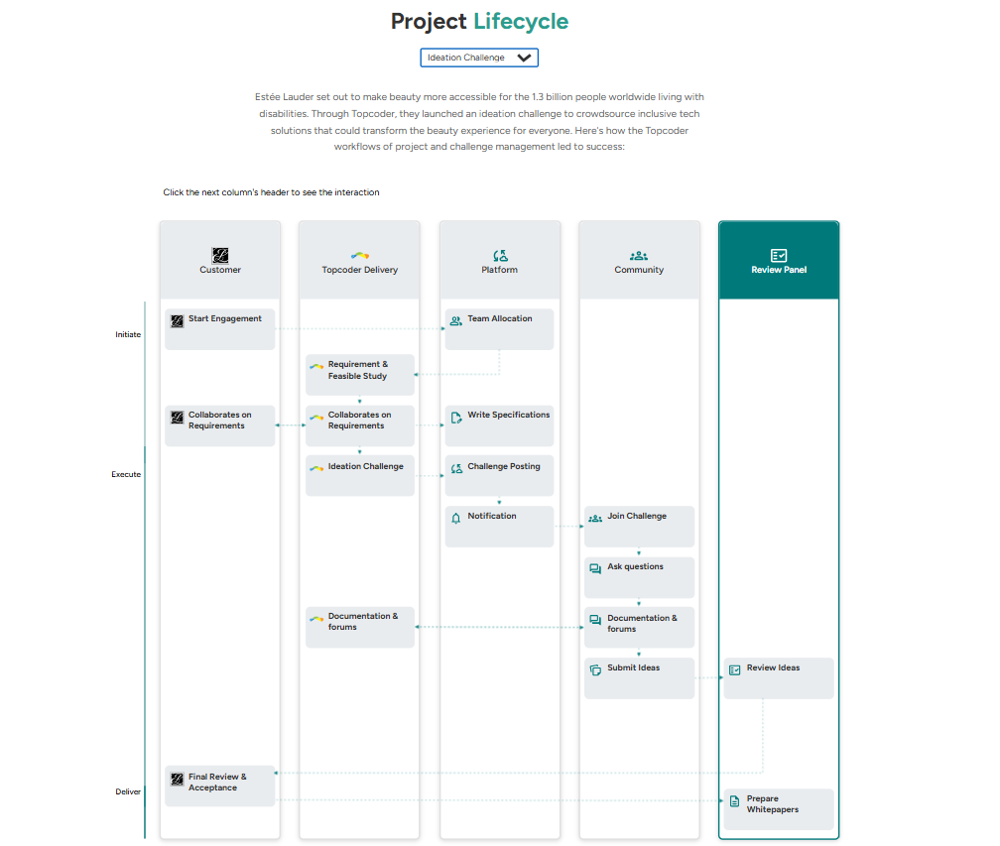
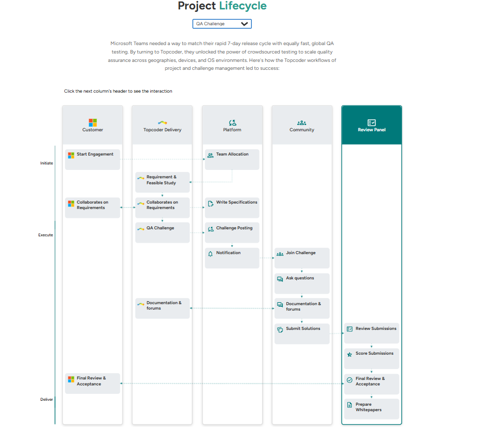

# Topcoder Engagement Timeline Component

<div style="display: flex; justify-content: space-between;">
  
  

</div>

This project implements a Kanban-style, role-based timeline component for Topcoder, built with **React.js**, **TypeScript**, and **SCSS**. The component visualizes the customer engagement process across key roles (Customer, Delivery Platform, Operation, Community, and Review) using a dynamic, interactive timeline. The application is designed for reusability, supports desktop and mobile layouts, and is deployed on **Netlify** for live preview.

    👇🏻👇🏻👇🏻👇🏻👇🏻👇🏻

<a href="https://lively-crepe-4b4b21.netlify.app/" style="display: inline-block; padding: 8px 16px; background-color: #007bff; color: #fff; text-decoration: none; border-radius: 4px; font-family: 'Nunito', sans-serif;">View Live Demo</a>

## Features

- **Kanban-Style Timeline**: Displays a role-based timeline with columns for Customer, Delivery Platform, Operation, Community, and Review, following the provided Figma design.
- **Dynamic Data Loading**: Initially, only the Customer column is populated. Clicking a column header populates it and all columns to its left, while hiding columns to its right.
- **Challenge Type Dropdown**: Supports five challenge types (Design Challenge, Development Challenge, QA Challenge, Marathon Match, Ideation Challenge) to control displayed data and text above the Kanban board.
- **Tooltips**: Displays tooltips on hover (or tap on mobile) for each item in the Kanban board, based on static data provided in the design.
- **Responsive Design**: Fully responsive for desktop and mobile, with horizontal scrolling on mobile for the Kanban board.
- **Static Assets**: All images and icons are served from the `/public/assets/icons` folder.
- **TypeScript**: Strongly typed components for type safety and maintainability.
- **SCSS Styling**: Scoped styles with proper class naming to avoid conflicts with other CSS in a larger codebase.
- **Reusability**: Modular, generic components designed for easy integration into a larger Next.js application.
- **Fonts**: Uses Figtree and Nunito from Google Fonts.
- **Deployment**: Deployed on Netlify for live access.

## Tech Stack

- **Framework**: React
- **Language**: TypeScript
- **Styling**: SCSS
- **Fonts**: Figtree, Nunito (Google Fonts)
- **Deployment**: Netlify

## Prerequisites

To run this project locally, ensure you have the following installed:

- **Node.js**: v16 or higher
- **npm** or **yarn**: Package manager for dependencies
- **Git**: For cloning the repository

## Setup Instructions

1.  **Clone the Repository**:

    ```bash
    git clone https://github.com/Tsegaye16/topcoder-project-lifecycle
    cd topcoder-project-lifecycle
    ```

    Install Dependencies:
    Using npm:

    ```bash
    npm install
    ```

    Or using yarn:

    ```bash
    yarn install
    ```

    Run the Development Server:
    Start the React.js development server:

    ```bash
    npm start
    ```

    Or with yarn:

    ```bash
    yarn start
    ```

    The application will be available at http://localhost:3000.

    #### Build for Production:

    To create an optimized production build:

    ```bash
    npm run build
    ```

    Then, preview the production build locally:

    ```bash
    npm run start
    ```

    #### Verifying and Testing Locally

    To verify the functionality and test the application locally:
    Access the Application:
    Open http://localhost:3000 in your browser after starting the development server.

    - Test the Kanban Board:

      - Initial State: Ensure only the Customer column is populated with data on page load.

        - Column Interaction: Click on any column header (e.g., Operation) to populate it and all columns to its left, while hiding columns to its right.

        - Dropdown Functionality: Select different challenge types from the dropdown (Design Challenge, Development Challenge, etc.) and verify:

          - The Kanban board resets to show only the Customer column.

          - The text above the board updates based on the selected challenge type.

        - Tooltips: Hover over (or tap on mobile) items in the Kanban board to verify tooltips display the correct content per the design.

        - Responsive Design: Resize the browser window or use developer tools to simulate mobile devices. Verify:

          - The layout adapts to mobile design.
          - Horizontal scrolling works for the Kanban board on mobile.

      - Check Styling:

        - Ensure fonts (Figtree, Nunito) are applied correctly.

        - Verify that SCSS styles match the Figma design and are scoped to avoid conflicts.

        - Confirm all assets (images, icons) load correctly from /public/assets.

    - TypeScript Validation:
      Run the TypeScript compiler to check for type errors:
      ```bash
       npm run tsc
      ```
    - Deployment on Netlify

      The application is deployed on Netlify for live access. To replicate or update the deployment:

      - Install Netlify CLI (optional for local testing):

      ```bash
      npm install -g netlify-cli
      ```

      - Build the Project:
        Ensure a production build is created:
        ```bash
        npm run build
        ```
        - Deploy to Netlify:
          Using Netlify CLI:
        ````bash
        netlify deploy
        Follow prompts to log in and select the /out folder or connect to a Netlify site.
        For production deployment:
        ```bash
        netlify deploy --prod
        ````

### Live URL

The deployed application is accessible at:  
 👉👉👉👉 https://lively-crepe-4b4b21.netlify.app/
